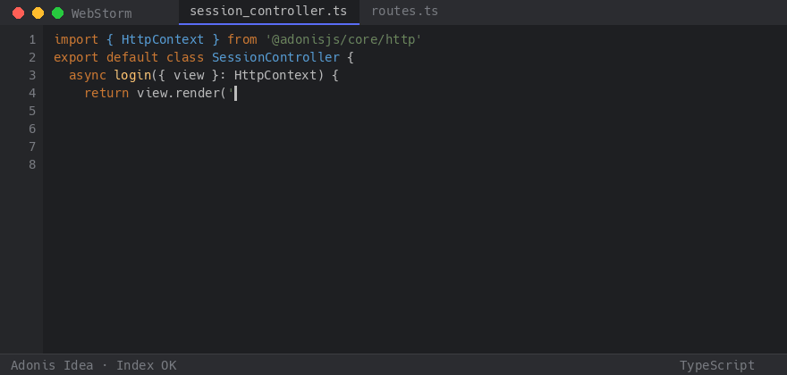
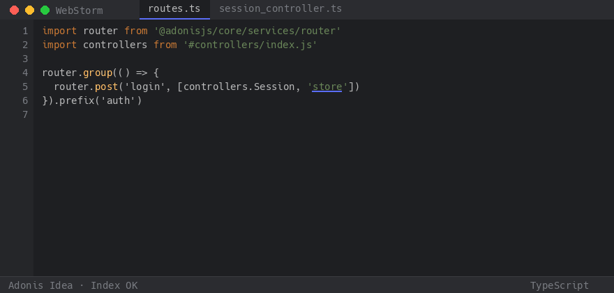
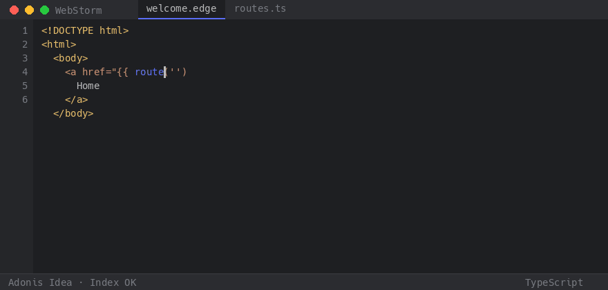
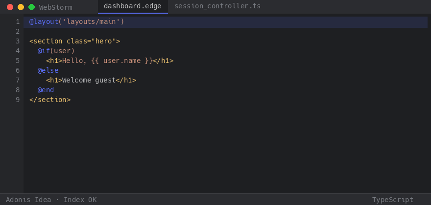
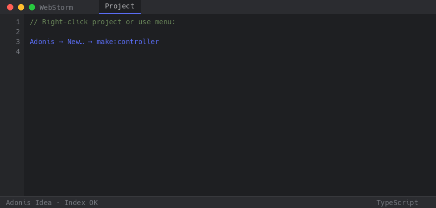

<p align="center">
  
</p>

<p align="center">
  <a href="https://github.com/coolsam726/adonis-idea/releases"></a>
  <a href="https://www.jetbrains.com/webstorm/"></a>
  <a href="LICENSE"></a>
  <a href="COVERAGE.md"></a>
</p>

<p align="center">
  
  
  
  <a href="https://github.com/coolsam726/adonis-idea/actions/workflows/ci.yml"></a>
</p>

**Adonis Idea** is a native JetBrains plugin for [AdonisJS](https://adonisjs.com) in **WebStorm**.  
It adds Edge language support, deep completions, precise navigation, Ace generators, Lucid/Mongoose helpers, Wire attributes, and optional [Shamar](https://github.com/coolsam726/shamar) intelligence — **without requiring any `@shamar/*` packages**.

Plugin id: `dev.shamar.adonis.ide`

---

## Quick start

### 1. Install

1. Download the latest `.zip` from [GitHub Releases](https://github.com/coolsam726/adonis-idea/releases).
2. In WebStorm: **Settings → Plugins → ⚙ → Install Plugin from Disk…** → pick the zip.
3. Restart the IDE when prompted.

> Installing, updating, or removing the plugin requires a restart.

### 2. Open an Adonis app

Open a project that has `adonisrc.ts` (or `ace.js`).  
Node.js must be on your `PATH` so the bundled indexer can run.

### 3. Confirm it’s working

| Check | What you should see |
| --- | --- |
| Edge files | `*.edge` open as language **Edge** (not plain Text) |
| Index | Status bar / **Adonis** tool window shows a healthy index |
| Menu | **Adonis → Rebuild Index** is available |

Force a refresh anytime with **Adonis → Rebuild Index**.

---

## Everyday usage

### Complete view paths

In a controller, type inside `view.render('…')` (or `view.renderSync`):

```ts
return view.render('pages/auth/|')
```



Works the same for Edge `@include`, `@layout`, and `@!component`.

### Jump to the exact controller action

In `start/routes.ts`:

```ts
router.post('login', [controllers.Session, 'store'])
```

**Ctrl-click** (or Go to Declaration) on `'store'` opens **`SessionController#store` only** — not every method named `store` in the project.



### Complete named routes

In Edge or TypeScript:

```edge
<a href="{{ route('hom|') }}">Home</a>
```



Also works for `route()`, `router.*.as('…')`, and Shamar convention names when Shamar is present.

### Edit Edge templates

`*.edge` files get native highlighting, HTML dual-PSI (tags still complete), `@directive` awareness, and structure checks for unmatched `@if` / `@each` / `@end`.



### Generate files with Ace

Use **Adonis → New…** (also on the IDE **New** menu) for `make:controller`, `make:model`, migrations, validators, Wire components, and more.



Or run Ace from a run configuration: **Run → Edit Configurations → + → Ace**.

---

## What you get

<details open>
<summary><strong>Completions & navigation</strong></summary>

| You type / click | Plugin helps with |
| --- | --- |
| `route('…')` / `.as('…')` | Named routes → declaration |
| `view.render('…')` / `@include` | View & component paths |
| `config('…')` | Dotted config keys |
| `.env` / `env.get('…')` | Keys, suggested values, bulk insert |
| `[controllers.X, '…']` | Actions on **that** controller only |
| `User.query().where('…')` | Columns / relations (Lucid or Mongoose) |
| `@wire('…')` / `$wire.` | Wire components, props, methods |
| `{{ var }}` in Edge | Shared / view data helpers |

**Ctrl-hover** underlines navigable symbols. **Find Usages** and **Rename** work for indexed routes, views, config, and env keys.

</details>

<details>
<summary><strong>Edge language</strong></summary>

- Native file type with HTML colors under Edge overlays  
- Dual PSI roots so HTML inspections keep working  
- `@if` / `@each` / `@component` / `@wire` / `@persist` / `@end`  
- Structure diagnostics for mismatched blocks  

</details>

<details>
<summary><strong>ORM & database</strong></summary>

- Lucid models + migration columns; `where` / `preload` chain completion  
- Mongoose schema awareness when detected  
- DB connection hints planned from `.env` (`DB_*`)  

</details>

<details>
<summary><strong>Wire & optional Shamar</strong></summary>

**Wire** (always when `app/wire` exists): `wire:*` attributes, `@wire`, `<wire:…>`, `$wire` props/methods, GTD to class ↔ view.

**Shamar** activates only if `@shamar/adonis` or `app/panels/` is present:

- Resources, pages, panels, navigation groups  
- Field / column type catalogs  
- Convention routes `shamar.{panel}.*`  
- Edge namespaces `shamar::` / `wire::`  

No Shamar packages are required to install or index a plain Adonis app.

</details>

---

## Requirements

- **WebStorm** 2024.2+  
- An AdonisJS app (`adonisrc.ts` or `ace.js`)  
- **Node.js** on `PATH` (bundled indexer)

Smoke-test the indexer from a clone of this repo:

```bash
node indexer/index.mjs --path /path/to/your-adonis-app --json | head
```

---

## Troubleshooting

| Problem | Fix |
| --- | --- |
| No completions / empty tool window | Confirm Node is on `PATH`, then **Adonis → Rebuild Index** |
| `*.edge` opens as HTML | **Settings → Editor → File Types** → associate `*.edge` with **Edge** |
| Stale symbols after big changes | **Adonis → Rebuild Index** |
| Ctrl-click on `'store'` still lists many symbols | Update to the latest release, then **Adonis → Rebuild Index** |
| Plugin not offered in other IDEs | WebStorm is the supported product |

Feature matrix vs Laravel IDEA / almasix-idea: [PARITY.md](PARITY.md).

---

## Develop & release

```bash
./gradlew test koverVerify   # 100% line coverage gate
./gradlew buildPlugin        # → build/distributions/*.zip
./gradlew runIde             # WebStorm sandbox
```

Regenerate README demo GIFs:

```bash
python3 scripts/generate-readme-gifs.py
```

Coverage notes: [COVERAGE.md](COVERAGE.md). Changelog: [CHANGELOG.md](CHANGELOG.md).

GitHub Release on a `vX.Y.Z` tag builds the zip and can publish to the JetBrains Marketplace (`JETBRAINS_PUBLISH_TOKEN`).

---

## License

[MIT](LICENSE)
